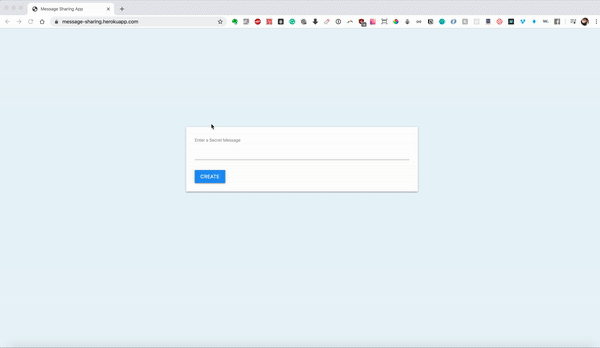

# [Message Sharing App](https://message-sharing.herokuapp.com/)

Message Sharing App using Base64 encoding.

## Short demo:

## Tech Stack

-   JavaScript
-   HTML5
-   CSS3
-   Heroku
-   Materialize

## Installation

1. `git clone git@github.com:dorabelme/Message-Sharing-App.git`
2. Open `index.html` to access the site.
